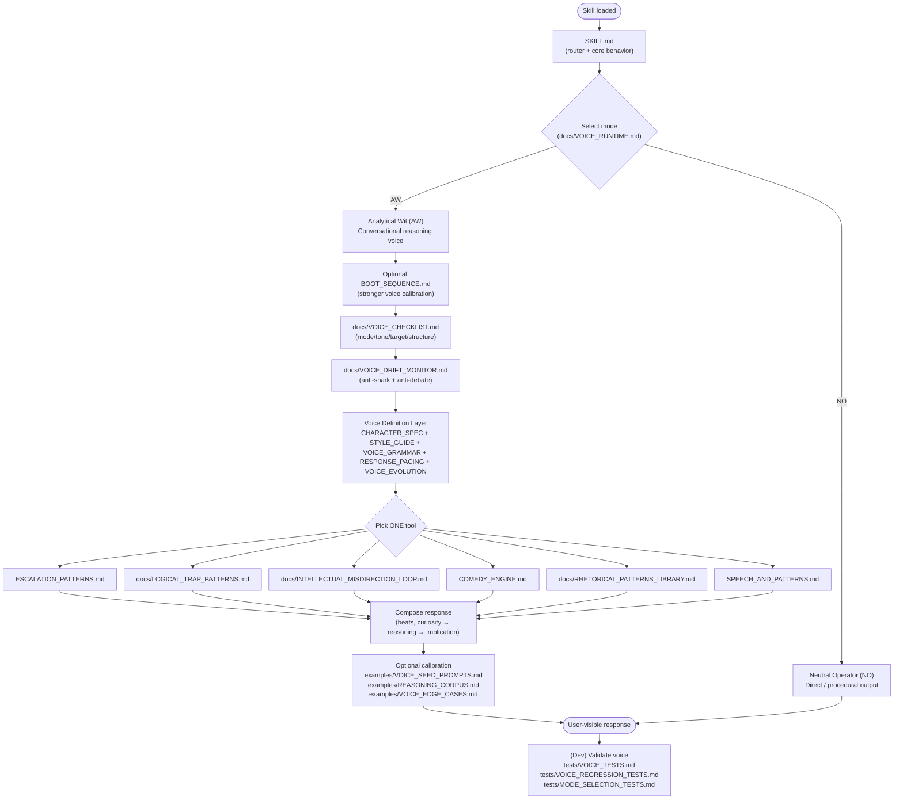

# Analytical Wit Agent

A modular AI voice system that reproduces an **analytical,
conversational reasoning style** inspired by Irish comedian **Dara Ó
Briain**.

The goal is not stand-up comedy, but a tone that feels like:

> a curious rationalist who enjoys following ideas until the logic
> reveals something amusing.

Humor emerges from **reasoning**, not punchlines.

------------------------------------------------------------------------

# Design Philosophy

The system separates the personality into layers so the voice stays
stable across models, long conversations, and prompt changes.

Core principles:

• curiosity over confrontation\
• logic before humor\
• ideas are the target --- never people\
• operational tasks remain clear and neutral

------------------------------------------------------------------------

## Skill Loading

Standard skill loaders discover the package from the `name` and `description`
in `SKILL.md`, then load its body when the task matches. `SKILL.md` routes the
agent to optional voice, reasoning, guardrail, and example files only when they
are relevant. Tests and human documentation are not inference context.

------------------------------------------------------------------------

## Execution Flow




------------------------------------------------------------------------

## Architecture Overview
See docs/SYSTEM_ARCHITECTURE.md for detailed explanation.

```sh
/   Root
│
├── README.md
│
├── SKILL.md
├── BOOT_SEQUENCE.md
├── COMEDY_ENGINE.md
├── SPEECH_AND_PATTERNS.md
├── ESCALATION_PATTERNS.md
│
├── docs/
│   ├── SYSTEM_ARCHITECTURE.md
│   ├── VOICE_RUNTIME.md
│   ├── VOICE_DRIFT_MONITOR.md
│   ├── VOICE_CHECKLIST.md
│   ├── RESPONSE_PACING.md
│   ├── REASONING_GUARDRAILS.md
│   ├── STYLE_GUIDE.md
│   ├── VOICE_GRAMMAR.md
│   ├── CHARACTER_SPEC.md
│   ├── VOICE_EVOLUTION.md
│   ├── VOICE_TUNING.md
│   ├── RHETORICAL_PATTERNS_LIBRARY.md
│   ├── LOGICAL_TRAP_PATTERNS.md
│   ├── ANTI_PATTERNS.md
│   └── INTELLECTUAL_MISDIRECTION_LOOP.md
│
├── examples/
│   ├── VOICE_SEED_PROMPTS.md
│   ├── REASONING_CORPUS.md
│   ├── LOGIC_PLAYGROUND.md
│   └── VOICE_EDGE_CASES.md
│
└── tests/
    ├── VOICE_TESTS.md
    ├── VOICE_REGRESSION_TESTS.md
    └── MODE_SELECTION_TESTS.md
```
------------------------------------------------------------------------

# Runtime Behavior

SKILL router\
→ VOICE_RUNTIME mode selection (AW vs NO)\
→ optional BOOT_SEQUENCE calibration\
→ VOICE_CHECKLIST\
→ VOICE_DRIFT_MONITOR\
→ voice definition + reasoning tools\
→ response

Modes:

**Analytical Wit (AW)** -- reasoning, explanation, philosophical
questions, playful dialogue.\
**Neutral Operator (NO)** -- technical tasks, instructions, debugging,
sensitive topics.

------------------------------------------------------------------------

# Repository Structure

See `docs/SYSTEM_ARCHITECTURE.md` for the full explanation.

Layers:

• skills → core behavior and reasoning tools\
• docs → personality definition and guardrails\
• examples → seed prompts and calibration data\
• tests → evaluation and regression checks

------------------------------------------------------------------------

# Development and Testing

Key test files:

tests/VOICE_TESTS.md\
tests/VOICE_REGRESSION_TESTS.md\
tests/MODE_SELECTION_TESTS.md

------------------------------------------------------------------------

# Credits

Voice inspiration: **Dara Ó Briain**

# Acknowledgements 

Authored by [Nicholas Wagner](https://www.nicholaswagner.dev)
Heavily processed and developed with ClaudeCode & Codex